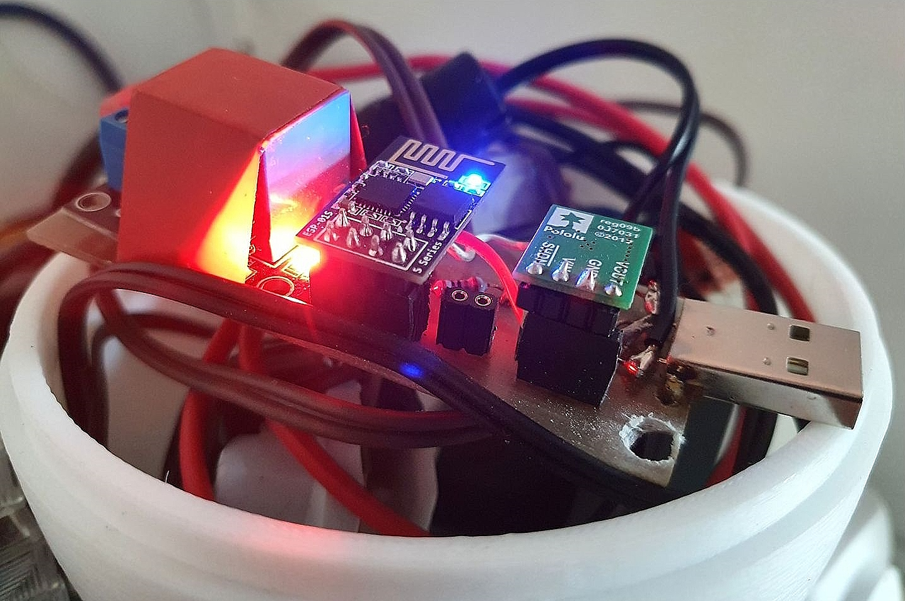

Maker Media GmbH

# IR-Fernbedienung

## Smartphone ersetzt eine Handvoll Fernbedienungen

**Infrarot-Fernbedienungen versenden in Signalen verschlüsselte
Zeichenketten als Befehle. Mit Mikrocontroller und IR-Empfänger
oder -Transceiver lassen sich diese entschlüsseln wie auch
nachbilden. Ein Smartphone und ein WLAN-fähiger Mikrocontroller
ersetzen so eine ganze Sammlung alter IR-Fernbedienungen.**

Hier gibt es im Ordner [_src_](./src/) den Arduino-Code zum Projekt. Im Ordner [_doc_](./doc/) liegt unter anderem die Fritzing-Datei mit dem Steckbrett-Aufbau der universellen Fernbedienung, dazu Fritzing-Dateien für das verwendete Relais und den Step-down-Wandler.

Der vollständige Artikel zum Projekt steht in der **[Make-Ausgabe 1/24 ab Seite 72](https://www.heise.de/select/make/2024/1/2331116042343551026)**.